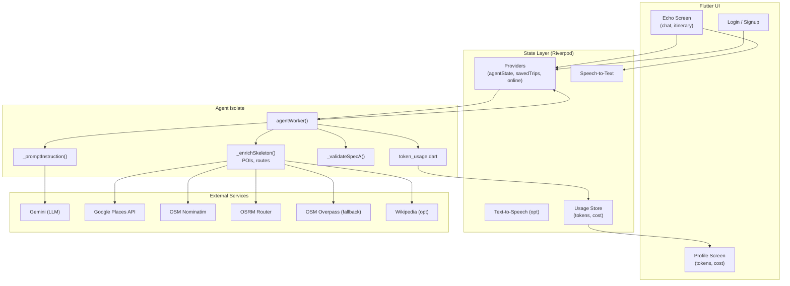

# Smart Trip Planner (Flutter)

A fast, offline-friendly itinerary planner powered by Gemini + real‑world POI enrichment (Google Places + OSM), with incremental streaming, speech input, and token/cost tracking.

---

## 1) Setup

### Prerequisites
- Flutter (3.22+)
- Dart (3.4+)
- Android Studio (SDK/AVD) or Xcode
- Git

### macOS setup (recommended)
```bash
# Tooling
brew install --cask flutter
brew install cocoapods
brew install --cask android-studio
# (Optional) Firebase CLI if you plan to use Firebase later
brew install firebase-cli
```

Then:
```bash
flutter doctor
flutter pub get
```

iOS first build:
```bash
cd ios
pod install
cd ..
```

### Windows setup
```powershell
winget install Google.AndroidStudio
winget install Git.Git
# Install Flutter via zip then add to PATH (recommended by Flutter docs)
# Verify:
flutter doctor
flutter pub get
```

### Keys and configuration
The app reads keys from lib/constants.dart (no .env needed):

- Secrets.api_key → Gemini API Key
- Secrets.places_api_key → Google Places API Key (optional but recommended)

Enable these Google APIs for your key:
- Generative Language API (Gemini)
- Places API

### Permissions (Speech features)
Android: android/app/src/main/AndroidManifest.xml
```xml
<uses-permission android:name="android.permission.RECORD_AUDIO" />
```

iOS: ios/Runner/Info.plist
```xml
<key>NSSpeechRecognitionUsageDescription</key>
<string>This app uses speech recognition to capture your trip vision.</string>
<key>NSMicrophoneUsageDescription</key>
<string>This app needs the microphone for speech input.</string>
```

### Run
```bash
flutter pub get
flutter analyze
flutter run
```

---

## 2) Architecture diagram



---

## 3) How the agent chain works (prompt, tools, validation)

### a) Prompt construction
- The UI sends [prompt, prevJson?, chatHistory?, replyPort] to the agent isolate.
- _promptInstruction() builds a strict JSON-only instruction targeting “Spec A”:
  - Fields: destination, title, startDate, endDate, days[date, summary, items[time, activity, place/search]]
  - Rules: Arrival + Check‑in on Day 1, realistic times, last‑day departure, 3–5 items/day, no route items.

### b) LLM call (Gemini)
- GenerativeModel('gemini-1.5-flash-latest', responseMimeType='application/json').
- Generates a skeleton itinerary JSON (no markdown).

### c) Skeleton normalization
- _safeDecodeMap() extracts JSON.
- _ensureContinuousDays() fixes gaps/missing days between start/end.

### d) Destination resolution
- _geocodeOSM() (Nominatim) resolves “City, Country” to lat/lon.

### e) Enrichment pipeline
For each day/item:
- Classify item (meal/lodging/other) and infer budget (_inferBudget()).
- Strengthen weak queries with city/near context (e.g., “restaurants near <anchor> in <city>”).
- Look up POIs:
  - Primary: Google Places Text Search (ratings, price level, map links).
  - Fallbacks: OSM Nominatim search, Overpass (restaurants by amenity).
- Choose candidates by score (rating, reviews, price vs. budget) and proximity to destination center.
- Compute route distance/time between consecutive items via OSRM.
- Group by time-of-day, then nearest-neighbor ordering to reduce zig‑zagging.

Streaming:
- onDelta is called to send partial days as they resolve.
- A final “done” message returns the full itinerary and aux geo meta.

### f) Validation and output
- _validateSpecA() enforces required fields on each day/item.
- Reply payloads:
  - type: "delta" | "done" | "error"
  - data: Spec A itinerary
  - aux: geo details for each item (lat, lon, address, rating, priceLevel, mapLink, distanceText, durationText)
  - tokens: prompt/completion/total + costUSD (computed via token_usage.dart)

### g) Token accounting and cost
- Uses resp.usageMetadata when available.
- Falls back to approximate tokenization from input/output text length.
- Cost uses Google’s public rates:
  - gemini‑1.5‑flash‑latest: $0.35 / 1M input, $0.53 / 1M output.

---

## 4) Speech features

### Speech‑to‑Text (already integrated)
Dependency:
```yaml
speech_to_text: ^6.5.0
```
- Android: RECORD_AUDIO permission.
- iOS: NSSpeechRecognitionUsageDescription + NSMicrophoneUsageDescription.
- Use a single initialized SpeechService instance and call toggle() from the mic icon. Recognized text updates the same TextEditingController.


---

## 5) Project layout (key files)

```
lib/
  constants.dart                 # Secrets.api_key, Secrets.places_api_key
  data/services/
    agent_isolate.dart          # LLM + enrichment isolate

  presentations/screens/
    echo_screen.dart            # Home/Agent screen
  services/
    speech_service.dart         # mic input (speech_to_text)
  ui/
    profile/                    # profile screen (tokens/cost)
    home/                       # home widgets (mock layout)

```

```


---

## 7) Demo video
```
https://drive.google.com/drive/folders/13zQKTeOL4PlCxHis-DBSWeJ3uGHBZkDT?usp=sharing
```

---


